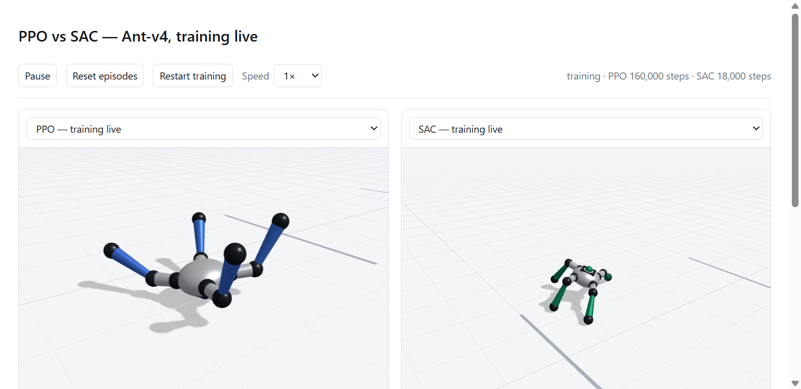
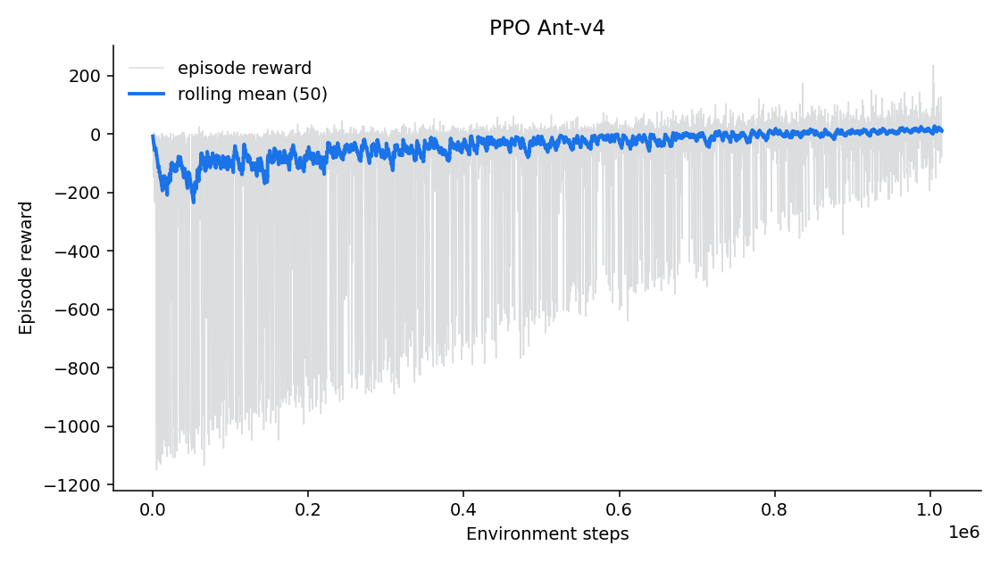
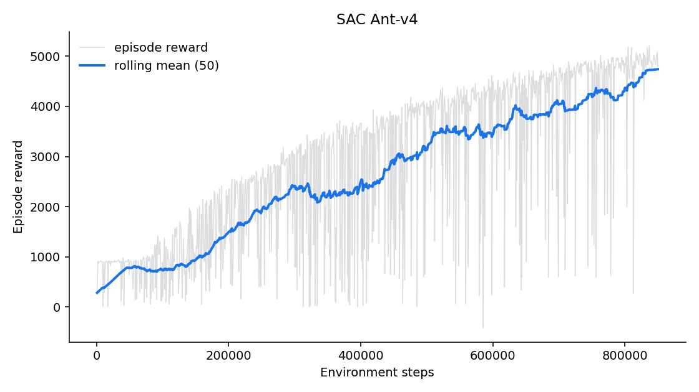
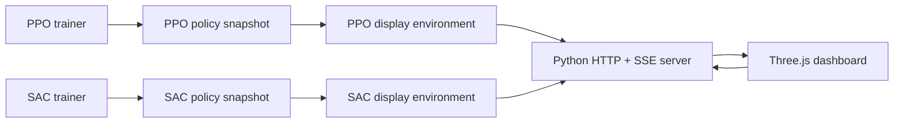

# Quadruped Locomotion with Reinforcement Learning

An end-to-end continuous-control project that trains Gymnasium's MuJoCo
`Ant-v4` with **Proximal Policy Optimization (PPO)** and
**Soft Actor-Critic (SAC)**. It includes reproducible training, SAC
checkpoint/resume support, robustness experiments through domain
randomization, and a browser-based live comparison of both algorithms.



## Live application

`live_server.py` creates fresh PPO and SAC agents, trains them concurrently,
and periodically copies each policy into a deterministic display environment.
The Python backend streams MuJoCo body transforms and metrics with
Server-Sent Events. Three.js renders both robots in the browser.

The interface provides:

- synchronized PPO and SAC 3D views;
- current training steps, rolling reward, episode return, and distance;
- a wall-clock learning curve;
- pause, display reset, simulation speed, and policy selection controls;
- optional comparison with locally saved final policies.

## Quick start

Python 3.10 or newer is required. Python 3.12 is used in this repository.

```powershell
git clone https://github.com/aqibowais/quadruped-rl-sim.git
cd quadruped-rl-sim

python -m venv .venv
.\.venv\Scripts\Activate.ps1
python -m pip install --upgrade pip
pip install -r requirements.txt

python live_server.py
```

Open `http://127.0.0.1:8080`.

On macOS or Linux, activate with `source .venv/bin/activate`.

To stop the server running in the foreground, press `Ctrl+C`. To find and stop
a detached listener on Windows:

```powershell
$pid = (Get-NetTCPConnection -LocalPort 8080 -State Listen).OwningProcess
Stop-Process -Id $pid
```

## Experiment workflow

Run standalone one-million-step experiments:

```powershell
python train.py --algo ppo --timesteps 1000000
python train.py --algo sac --timesteps 1000000
```

Evaluate and plot:

```powershell
python evaluate.py --model ppo
python evaluate.py --model sac
python plot_results.py
tensorboard --logdir tb_logs
```

Test robustness to randomized torso mass and friction:

```powershell
python robustness.py --model sac
```

Run the complete offline pipeline:

```powershell
python run_pipeline.py
```

## Checkpoint-safe SAC continuation

SAC checkpoints include both model parameters and the replay buffer. The
absolute timestep count is preserved when training resumes.

Stop after 150,000 steps:

```powershell
python train.py --algo sac --timesteps 1000000 --stop-at 150000
```

Continue toward the original one-million-step target:

```powershell
python train.py --algo sac --timesteps 1000000 `
  --resume models/checkpoints/sac/sac_150000_steps.zip
```

Checkpoints are generated every 50,000 steps by default.

## Method

- **Environment:** Gymnasium `Ant-v4`, with 1,000-step episode limits.
- **Algorithms:** Stable-Baselines3 PPO and SAC with explicit project
  hyperparameters.
- **Budget:** 1,000,000 environment steps for each formal run.
- **Metrics:** episode return, episode length, wall-clock time, evaluation
  return, and training throughput.
- **Robustness:** torso mass sampled from `U(0.7, 1.3)` and per-geometry
  friction sampled from `U(0.5, 1.5)` at reset.
- **Hardware:** CPU MuJoCo simulation with CUDA acceleration for supported
  PyTorch training workloads.

The formal comparison uses a fixed step budget. The live dashboard also shows
wall-clock progress because PPO and SAC perform different amounts of
computation per environment step.

## Recorded result

The saved SAC artifact completed a nominal ten-episode evaluation with:

- mean return: **4,766.32**;
- standard deviation: **1,198.86**;
- mean episode length: **925.4**;
- nine of ten episodes reaching the 1,000-step limit.

This is one run with one seed, not evidence that SAC is universally superior.
The saved PPO run is substantially weaker and should be rerun across multiple
seeds before drawing a formal algorithm-level conclusion.





## Architecture



Training environments and display environments are deliberately separate.
Training can run as fast as the machine permits while the display advances at
a human-readable real-time rate.

## Documentation

- [Complete beginner and interview guide](docs/PROJECT_GUIDE.md)
- [Deployment and public access guide](docs/DEPLOYMENT.md)

The project guide covers RL terminology, MDPs, observations, actions, rewards,
PPO, SAC, replay buffers, normalization, MuJoCo, domain randomization,
checkpointing, live-stream architecture, evaluation, limitations, common
interview questions, and troubleshooting.

## Deployment

The application requires Python, MuJoCo, PyTorch, memory for SAC's replay
buffer, and a continuously running process. It cannot run on a static host
such as GitHub Pages.

For a temporary free public demonstration:

```powershell
winget install Cloudflare.cloudflared
.\scripts\public_demo.ps1
```

For persistent hosting, build the included container:

```powershell
docker build -t quadruped-rl-live .
docker run --rm -p 7860:7860 quadruped-rl-live
```

See the [deployment guide](docs/DEPLOYMENT.md) for hosting requirements,
security limitations, public GitHub instructions, and current free-tier
constraints.

## Repository structure

```text
dashboard/                Browser UI and Three.js renderer
docs/                     Project and deployment documentation
scripts/                  Public demo launcher
live_server.py            Concurrent live training and streaming backend
train.py                  Reproducible PPO/SAC training
evaluate.py               Frozen-policy evaluation
randomize_env.py          Environment factory and domain randomization
robustness.py             Robustness evaluation and fine-tuning
plot_results.py           Curves and result summaries
run_pipeline.py           Complete offline workflow
Dockerfile                CPU container deployment
requirements.txt          Full local experiment dependencies
requirements-deploy.txt   Minimal live-service dependencies
results/                  Small plots and JSON summaries
```

Models, replay buffers, logs, TensorBoard data, reports, and media are
generated locally and excluded from Git. The local SAC replay buffers are
hundreds of megabytes each and are not source code.

## Scope and limitations

This is a simulation study, not a hardware deployment. Ant-v4 does not model
the actuator latency, state estimation, battery behavior, structural
compliance, sensing noise, or terrain variation of a physical quadruped.
Mass/friction randomization tests only a narrow part of the sim-to-real gap.

The live server is a shared, process-local research demo. It does not provide
per-user jobs, authentication, persistent training state, or distributed
workers.
