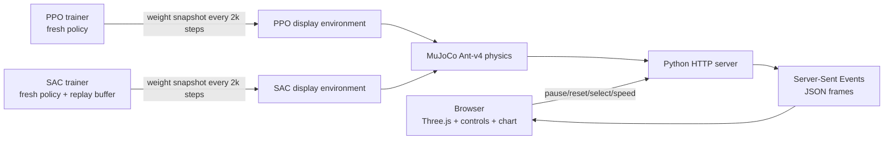
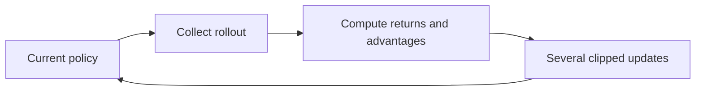
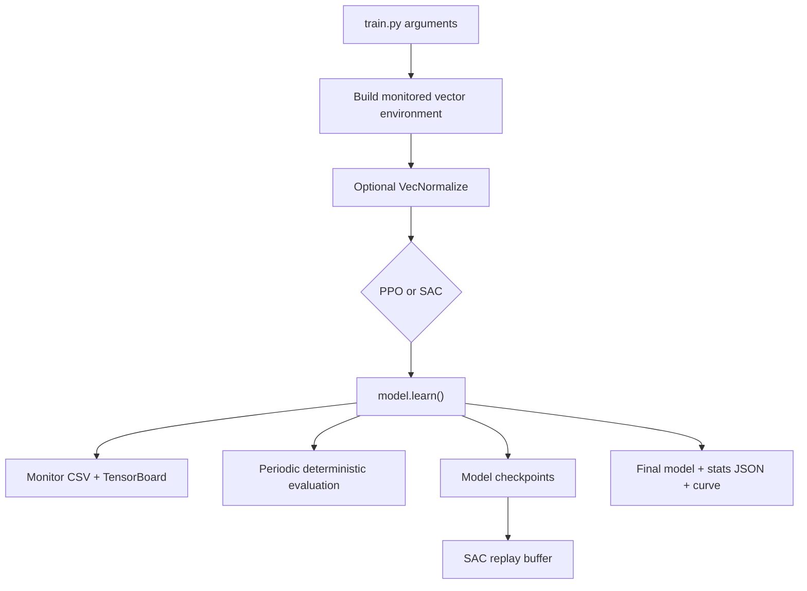

# Quadruped Reinforcement Learning: complete project guide

This guide explains the project from first principles. It is written for a
beginner who wants to understand the implementation, reason about the
experimental results, and discuss the work accurately in an interview.

## 1. The project in one minute

The project asks a control question:

> Can a simulated four-legged robot learn a useful locomotion policy from
> rewards, and how do two common reinforcement-learning algorithms compare?

The robot is Gymnasium's `Ant-v4`, simulated by MuJoCo. Its controller receives
an observation describing the robot's current physical state and outputs
continuous torques for eight joints. Two algorithms learn this mapping:

- **PPO**, an on-policy actor-critic algorithm;
- **SAC**, an off-policy maximum-entropy actor-critic algorithm.

The repository has two related workflows:

1. `train.py` runs controlled experiments, saves models and checkpoints, logs
   metrics, evaluates policies, and supports domain randomization.
2. `live_server.py` starts fresh PPO and SAC trainers together and copies their
   current policies into two real-time display environments. The browser
   renders both robots and plots live reward curves.

The live viewer is not the scientific benchmark by itself. It is an
explainability and demonstration layer over real training processes.

## 2. System architecture



The trainers run as background threads. The display simulations advance near
real time. Training is allowed to run as fast as the machine permits. This
separation prevents the browser animation rate from controlling the learning
rate.

## 3. Reinforcement learning foundations

### Agent and environment

The **agent** is the learned controller. The **environment** is the simulated
robot and world. At each discrete step:

1. the environment gives the agent an observation;
2. the agent chooses an action;
3. MuJoCo advances the physics;
4. the environment returns a reward and the next observation;
5. the process repeats until the episode ends.

### Markov decision process

Reinforcement learning is commonly formalized as a Markov decision process,
or MDP:

- `S`: possible states;
- `A`: possible actions;
- `P(s' | s, a)`: transition dynamics;
- `R(s, a, s')`: reward;
- `γ`: discount factor.

The Markov assumption says the current state contains enough information to
predict the next-state distribution. A simulator has a full internal state,
but an agent usually receives an **observation**, which may omit information.

### State and observation

MuJoCo internally tracks positions, joint angles, orientations, velocities,
and contacts. Ant-v4 converts relevant values into a numeric observation
vector. A policy does not see an image in this project; it sees numbers.

This distinction matters in interviews:

- physics simulation produces the state transition;
- the observation vector is the policy input;
- Three.js is only visualization and does not affect policy decisions.

### Action

Ant-v4 has a continuous action space. The eight action values correspond to
actuator commands for the leg joints. Values are bounded, and MuJoCo turns
them into physical forces or torques according to the model.

This is why PPO and SAC are appropriate. Both handle continuous actions.
Algorithms designed only for discrete actions, such as basic DQN, are not a
direct fit without discretizing the controls.

### Policy

A **policy** is the behavior rule:

```text
observation -> action distribution
```

The policy is represented by a neural network. During training it is
stochastic so that it can explore. During display and evaluation this project
uses deterministic prediction to make behavior repeatable:

```python
action, _ = policy.predict(observation, deterministic=True)
```

### Reward and return

A reward is the immediate scalar feedback after one action. Ant rewards useful
motion and survival and penalizes wasteful control and undesirable contact.
The exact formula is defined by the Gymnasium environment version.

The **return** is accumulated future reward:

```text
G_t = r_t + γ r_(t+1) + γ² r_(t+2) + ...
```

The discount factor `γ = 0.99` makes near-term rewards slightly more important
while preserving a long planning horizon.

Reward is not the same as distance. A robot can move forward inefficiently,
fall early, or exploit a reward detail. The dashboard therefore shows reward
and distance separately.

### Episode, termination, and truncation

An **episode** is one attempted rollout. It can end because:

- the environment reports `terminated`, such as an unhealthy robot state;
- a time limit reports `truncated`, here at 1,000 steps.

These meanings should not be merged conceptually. Termination comes from the
task; truncation comes from an external limit.

### Value functions

The state-value function estimates expected return from a state:

```text
V(s) = expected future return from s
```

The action-value function estimates expected return after choosing an action:

```text
Q(s, a) = expected future return after action a in state s
```

Actor-critic methods contain:

- an **actor**, which chooses actions;
- a **critic**, which estimates value and provides a learning signal.

## 4. MuJoCo and Ant-v4

### What MuJoCo does

MuJoCo is the physics engine. It handles rigid-body dynamics, articulated
joints, collisions, contacts, friction, gravity, and numerical integration.
It is not the reinforcement-learning algorithm.

At one environment step, the selected action is held while MuJoCo performs
several smaller physics substeps. Ant-v4 advances about `0.05` seconds of
simulated time per environment step in this configuration.

### Why Ant-v4

Ant is a standard continuous-control benchmark with:

- four legs;
- eight actuated joints;
- nontrivial balance and contact dynamics;
- a continuous observation and action space;
- established use in RL comparisons.

It is useful for algorithm study, but it is not a high-fidelity model of a
Unitree, ANYmal, or a custom physical quadruped.

### Simulation versus rendering

The backend does not stream video. It sends body positions and quaternions:

```text
xpos  -> body positions
xquat -> body orientations
```

Three.js creates browser meshes and updates their transforms. A quaternion is
a four-number representation of 3D rotation that avoids some problems of
Euler angles, including gimbal lock.

## 5. PPO explained

PPO means **Proximal Policy Optimization**.

### On-policy learning

PPO collects a batch of experience using its current policy, optimizes on that
batch for several epochs, and then discards it. Because old experience came
from an older policy, PPO does not keep a long-lived replay buffer.

The flow is:



### Advantage

The advantage estimates whether an action was better or worse than the
critic's baseline:

```text
A(s, a) = Q(s, a) - V(s)
```

The code uses Generalized Advantage Estimation with `gae_lambda = 0.95`.
GAE balances noisy low-bias estimates against smoother high-bias estimates.

### Clipped objective

A large policy update can destroy a useful behavior. PPO compares the new and
old action probabilities and clips their ratio around 1:

```text
ratio = probability_new(action) / probability_old(action)
```

With `clip_range = 0.2`, excessively large improvements in the surrogate
objective are capped. This is a practical trust-region-like mechanism.

### Important PPO settings

- `n_steps`: rollout length collected before an update;
- `n_envs`: number of environments collecting data;
- `batch_size`: minibatch size during optimization;
- `n_epochs`: passes over one rollout batch;
- `learning_rate`: optimizer step size;
- `gamma`: return discount;
- `gae_lambda`: GAE bias-variance control;
- `clip_range`: limits policy change.

In the formal training script, PPO uses multiple environments to collect
experience efficiently. In the live server it uses two local environments so
that SAC still receives enough CPU time.

### PPO strengths and weaknesses

Strengths:

- usually stable and straightforward to tune;
- parallel rollout collection works well;
- no large replay buffer;
- widely used for locomotion.

Weaknesses:

- throws away data after updates;
- often needs many environment interactions;
- performance depends on rollout and normalization choices.

## 6. SAC explained

SAC means **Soft Actor-Critic**.

### Off-policy learning

SAC stores transitions in a replay buffer:

```text
(observation, action, reward, next_observation, done)
```

Training samples random minibatches from this buffer. A transition can be used
many times, so SAC is typically more sample-efficient than an on-policy
algorithm.

### Maximum-entropy objective

SAC optimizes reward and entropy:

```text
maximize expected reward + α * policy entropy
```

Entropy measures randomness. Reward encourages effective behavior; entropy
encourages continued exploration and avoids becoming deterministic too early.
`α` controls this tradeoff and is usually learned automatically by
Stable-Baselines3.

### Twin critics

Function approximation can overestimate Q-values. SAC trains two critics and
uses the smaller target estimate. This reduces optimistic value errors.

### Target networks and soft updates

Targets that change as quickly as the network being trained can destabilize
learning. SAC maintains target critic networks and slowly moves them toward
the current critics:

```text
target = (1 - τ) * target + τ * online
```

The project uses `tau = 0.005`.

### Important SAC settings

- `buffer_size`: maximum replay-buffer transitions;
- `learning_starts`: random collection before gradient updates;
- `batch_size`: transitions sampled per update;
- `train_freq`: environment steps between training phases;
- `gradient_steps`: optimizer updates per training phase;
- `tau`: target-network update rate;
- `gamma`: discount factor;
- `learning_rate`: actor and critic optimizer rate;
- `net_arch`: hidden-layer sizes.

### SAC strengths and weaknesses

Strengths:

- reuses experience and can be sample-efficient;
- exploration is part of the objective;
- strong continuous-control performance.

Weaknesses:

- a gradient update after nearly every step can be slow in wall-clock time;
- replay buffers consume memory and complicate checkpoints;
- more moving components make debugging harder.

## 7. PPO versus SAC: how to compare them fairly

There is no single definition of "better."

### Sample efficiency

Compare reward at the same number of environment steps. This asks:

> Which algorithm learns more from the same amount of interaction?

SAC often has an advantage because it reuses replay-buffer data.

### Wall-clock efficiency

Compare reward after the same elapsed time. This asks:

> Which algorithm gives a useful controller sooner on this machine?

PPO can collect vectorized experience quickly. SAC can be slowed by frequent
gradient updates.

### Final performance

Evaluate frozen policies over multiple seeded episodes and report mean,
standard deviation, episode length, and failures. A single attractive rollout
is not evidence.

### Fairness limitations in the live viewer

The live viewer is intentionally responsive, not a controlled publication
benchmark:

- PPO and SAC have different collection/update patterns;
- PPO uses multiple environments while SAC uses one;
- CPU and GPU workloads differ;
- browser display environments add small overhead;
- one random seed is insufficient for statistical conclusions.

For a scientific comparison, use the same environment-step budget, several
seeds, a predefined evaluation protocol, confidence intervals, and separately
report wall-clock cost.

## 8. Observation and reward normalization

Neural networks train more easily when input scales are controlled.
`VecNormalize` tracks running observation statistics and transforms values
approximately as:

```text
normalized = (observation - running_mean) / sqrt(running_variance + epsilon)
```

The normalized value is clipped to prevent extreme inputs.

If a PPO model was trained with normalization, evaluation must load the same
statistics. Loading only the network weights changes its input distribution
and can make a good policy appear broken. This is why the project saves
`ppo_vecnormalize.pkl`.

The live trainer copies both PPO weights and a snapshot of its observation
statistics to the display policy.

## 9. Formal training pipeline



`train.py` is responsible for:

- parsing reproducible command-line configuration;
- selecting CPU or CUDA;
- constructing vectorized environments;
- creating PPO or SAC with explicit hyperparameters;
- evaluating periodically;
- checkpointing;
- preserving timestep counts when resuming;
- saving result metadata.

## 10. Checkpoints and SAC resumption

Model weights alone are not enough for faithful SAC continuation. SAC's replay
buffer contains the experience distribution from which critics are learning.
Starting with weights but an empty buffer changes the optimization process.

The checkpoint callback therefore saves:

```text
sac_150000_steps.zip
sac_150000_steps_replay_buffer.pkl
```

On resume:

1. load the model;
2. attach the new environment;
3. load the matching replay buffer;
4. keep `model.num_timesteps`;
5. ask `learn()` to continue only for the remaining target steps;
6. set `reset_num_timesteps=False`.

The callback schedules by absolute `model.num_timesteps`, not callback-call
count, so checkpoints continue at 200k, 250k, and so on after a 150k resume.

Replay buffers are generated artifacts. They are large and intentionally
excluded from Git.

## 11. Live viewer implementation

### Why separate training and display environments

Training environments can run faster than real time, reset frequently, and
exist in batches. They are unsuitable as direct animation sources.

Each live lane therefore has:

- a trainer and mutable training policy;
- a CPU display-policy snapshot;
- a separate deterministic display environment.

Every 2,000 training steps, current policy parameters are copied while holding
a lock. The display thread can then use a stable policy copy without reading
weights during an optimizer update.

### Thread safety

Shared state includes policy weights, normalization statistics, panel
configuration, and streamed frames. Python locks prevent simultaneous
mutation and reading of these objects.

The critical sections are kept short. Expensive model rebuilding during
**Restart training** occurs outside the global simulation lock.

### Server-Sent Events

Server-Sent Events, or SSE, maintain a one-way HTTP stream from server to
browser:

```text
data: {"tick": 42, "panels": [...], "trainers": {...}}
```

SSE is appropriate because simulation state primarily flows server to client.
Control commands use ordinary JSON `POST /api/config` requests.

Compared with WebSockets, SSE is simpler, automatically reconnects in the
browser, and is sufficient for this one-directional telemetry stream.

### Three.js rendering

At setup, the server sends MuJoCo geometry metadata. The browser constructs
meshes once. Each streamed frame updates only body transforms.

The visual robot is an interpretation of the physical Ant geometry. Physics
continues to come from MuJoCo; changing colors or mesh styling does not change
the learned control problem.

### Dashboard metrics

- **Trained steps**: environment interactions consumed by that trainer.
- **Mean reward**: rolling mean from the trainer's recent completed episodes.
- **This episode**: reward accumulated in the display rollout.
- **Distance**: display torso displacement from its episode start.
- **Learning curve**: rolling reward plotted against wall-clock minutes.

Training reward and display reward serve different purposes. The first tracks
optimization; the second explains the current deterministic behavior.

## 12. Domain randomization and sim-to-real

A policy trained on one exact simulator can exploit its fixed parameters.
Real hardware differs in mass, friction, actuator response, latency, sensing,
terrain, and manufacturing tolerances.

`DomainRandomizationWrapper` changes, at episode reset:

- torso mass by a multiplier sampled from `U(0.7, 1.3)`;
- sliding friction by multipliers sampled from `U(0.5, 1.5)`.

The protocol is:

1. train on nominal physics;
2. evaluate frozen weights on nominal physics;
3. evaluate the same weights on randomized physics;
4. optionally fine-tune with randomization;
5. evaluate again on randomized physics.

A performance drop in step 3 measures sensitivity to the changed parameters.
Recovery in step 5 suggests training on a distribution produced a more robust
policy.

This is only a simplified sim-to-real study. It does not model:

- sensor noise and bias;
- command and communication latency;
- actuator saturation, heating, backlash, or battery voltage;
- state-estimation error;
- deformable or irregular terrain;
- structural differences from a real robot.

An accurate interview statement is:

> I tested robustness to a narrow simulated dynamics distribution. I did not
> claim successful transfer to hardware.

## 13. Logging, evaluation, and statistics

### Monitor logs

Stable-Baselines3 `Monitor` records completed episode reward and length.
Learning curves use rolling averages because raw episode returns are noisy.

### TensorBoard

TensorBoard visualizes training metrics over time:

```powershell
tensorboard --logdir tb_logs
```

Useful signals include episode reward, episode length, policy loss, value
loss, entropy, critic loss, and throughput.

### Deterministic evaluation

Evaluation uses a frozen policy with `deterministic=True`. Use multiple
episodes because initial states and dynamics produce variable outcomes.

Report:

- number of evaluation episodes;
- mean return;
- standard deviation;
- mean episode length;
- seed and environment version;
- nominal or randomized physics;
- deterministic or stochastic actions.

### Existing SAC result

The saved result artifact reports a ten-episode nominal evaluation mean near
`4,766`, with substantial variance and nine episodes reaching the 1,000-step
limit. This result belongs to one trained run and should not be generalized
to all seeds.

The PPO artifact in this working directory is much weaker. That is a valid
experimental outcome, not something to hide. Possible causes include
normalization/evaluation mismatches, seed sensitivity, premature termination,
or an underperforming run. A rigorous next step is a multi-seed rerun with a
fixed evaluation harness.

## 14. GPU and throughput

MuJoCo environment stepping is mostly CPU work. Neural-network optimization
can use CUDA.

SAC performs frequent gradient updates, so a GPU can help, but Ant's networks
are small. GPU utilization may remain low because the workload alternates
between CPU simulation, replay-buffer sampling, Python control flow, and small
matrix operations.

The project enables TF32 where available and avoids convolution-specific
autotuning. More GPU usage is not automatically more performance; end-to-end
steps per second and time-to-reward are the meaningful measurements.

## 15. Repository map

- `live_server.py`: concurrent trainers, display simulations, API, SSE.
- `dashboard/`: Three.js renderer, controls, metrics, and chart.
- `train.py`: reproducible standalone PPO/SAC training.
- `evaluate.py`: frozen-policy evaluation and optional local recording.
- `randomize_env.py`: Ant factory and domain-randomization wrapper.
- `robustness.py`: nominal/randomized evaluation and optional fine-tuning.
- `plot_results.py`: learning curves and experiment summaries.
- `generate_report.py`: technical PDF generation.
- `run_pipeline.py`: orchestration of the complete offline experiment.
- `Dockerfile`: portable CPU deployment.
- `scripts/public_demo.ps1`: temporary public HTTPS demo.
- `results/`: small plots and JSON summaries.
- `models/`, `logs/`, `tb_logs/`: generated locally and ignored by Git.

## 16. Common commands

Create and activate the environment on Windows:

```powershell
python -m venv .venv
.\.venv\Scripts\Activate.ps1
python -m pip install --upgrade pip
pip install -r requirements.txt
```

Start the live comparison:

```powershell
python live_server.py
```

Train reproducible standalone runs:

```powershell
python train.py --algo ppo --timesteps 1000000
python train.py --algo sac --timesteps 1000000
```

Stop SAC at 150k:

```powershell
python train.py --algo sac --timesteps 1000000 --stop-at 150000
```

Resume it:

```powershell
python train.py --algo sac --timesteps 1000000 `
  --resume models/checkpoints/sac/sac_150000_steps.zip
```

Evaluate:

```powershell
python evaluate.py --model ppo
python evaluate.py --model sac
```

Run robustness evaluation:

```powershell
python robustness.py --model sac
```

## 17. Troubleshooting

### `python` is not recognized

Python is installed at:

```text
C:\Users\Aqib\AppData\Local\Programs\Python\Python312
```

Both that directory and its `Scripts` directory must be before the Microsoft
Store alias in the user `PATH`. Restart Cursor after changing `PATH`, because
an already-running application keeps its old environment.

Verify in a new terminal:

```powershell
where.exe python
python --version
pip --version
```

The first path should point to the Python installation, not only
`WindowsApps\python.exe`.

You can always bypass activation with:

```powershell
.\.venv\Scripts\python.exe live_server.py
```

### Port 8080 is already in use

Find the listener:

```powershell
Get-NetTCPConnection -LocalPort 8080 -State Listen |
  Select-Object OwningProcess
```

Stop only that process:

```powershell
Stop-Process -Id <PID>
```

Or use another port:

```powershell
python live_server.py --port 8081
```

### MuJoCo DLL error on Windows

The repository pins MuJoCo `3.1.6` and imports `windows_mujoco.py` before
environment creation. Reinstall inside the active virtual environment if the
installation is inconsistent:

```powershell
pip install --force-reinstall mujoco==3.1.6
```

### A policy appears frozen

Check:

- whether the page is paused;
- whether the selected policy is a weak early checkpoint;
- whether the robot terminated and reset;
- whether normalized PPO observations use the saved statistics;
- whether the live step count is increasing.

Early policies often learn standing or low-motion behavior before locomotion.
That is training behavior, not a rendering failure.

## 18. Interview-ready explanation

### A concise project answer

> I built an end-to-end quadruped locomotion experiment using MuJoCo Ant-v4
> and Stable-Baselines3. I compared PPO, which is on-policy and easy to
> parallelize, with SAC, which is off-policy and reuses transitions through a
> replay buffer. I implemented checkpoint-safe SAC resumption, including the
> replay buffer and absolute timestep count. I also added mass and friction
> randomization to test a limited sim-to-real robustness question. For
> explainability, I built a live browser viewer that trains both algorithms
> from scratch, copies policy snapshots into real-time display environments,
> streams body transforms with SSE, and renders them in Three.js.

### Why use a separate display policy?

Training runs faster than real time and policy weights change during optimizer
steps. A periodically copied display policy gives the browser a stable,
deterministic controller without slowing or racing the trainer.

### Why save the SAC replay buffer?

SAC is off-policy. Its critics depend on the distribution of stored
transitions. Resuming only weights discards that learning context and changes
the experiment.

### Why can PPO be faster in time but less sample-efficient?

PPO collects many transitions in parallel and updates in batches. SAC reuses
data but performs frequent actor/critic updates. Therefore SAC may need fewer
environment steps while taking more computation per step.

### Why use domain randomization?

It discourages overfitting to one exact simulator. Training across a dynamics
distribution can improve robustness, but it only helps for variations covered
by that distribution.

### What would you improve next?

A strong answer is:

1. run at least five seeds per algorithm;
2. separate hyperparameter tuning from final evaluation;
3. report bootstrap confidence intervals;
4. add terrain, latency, sensor noise, and actuator variation;
5. persist live checkpoints and metrics;
6. isolate public users into queued training jobs;
7. validate on a higher-fidelity robot model before hardware transfer.

### What was technically difficult?

Good examples from this project:

- diagnosing Windows MuJoCo DLL/plugin compatibility;
- preserving SAC replay state across resumed runs;
- avoiding GPU/console overhead that reduced throughput;
- separating fast training from real-time deterministic visualization;
- synchronizing policy copies and streamed state safely;
- distinguishing sample efficiency from wall-clock efficiency.

## 19. Terms to know

- **Actor**: network that chooses actions.
- **Critic**: network that estimates value.
- **Advantage**: action quality relative to a state-value baseline.
- **Entropy**: randomness of a policy distribution.
- **Replay buffer**: stored transitions reused by off-policy learning.
- **Rollout**: sequence of environment interactions.
- **Trajectory**: state-action-reward sequence, often one episode.
- **Policy gradient**: gradient that changes policy parameters toward higher
  expected return.
- **Bootstrapping**: estimating a target partly from another learned estimate.
- **Target network**: slowly updated network used for stable targets.
- **Vectorized environment**: multiple environments stepped through one API.
- **Normalization**: rescaling values using running statistics.
- **Checkpoint**: serialized training state at a known step.
- **Domain randomization**: sampling simulator parameters during training or
  evaluation.
- **Sim-to-real gap**: mismatch between simulation and physical hardware.
- **SSE**: one-way HTTP event stream from server to browser.
- **Quaternion**: stable 3D rotation representation.
- **Deterministic evaluation**: selecting the policy's central/best action
  rather than sampling.
- **Seed**: initial pseudo-random state used for reproducibility.
- **Ablation**: experiment removing or changing one component to measure its
  effect.

## 20. Claims you should and should not make

You can claim:

- you implemented and compared real PPO and SAC training;
- the website visualizes current policy snapshots from live trainers;
- SAC continuation preserves its replay buffer and timestep count;
- you tested sensitivity to randomized mass and friction;
- you observed different sample and wall-clock behavior.

Do not claim:

- the stylized browser mesh is a new robot dynamics model;
- one run proves an algorithm is universally superior;
- domain randomization guarantees real-world transfer;
- this policy controls physical hardware;
- the dashboard is a scalable multi-user training platform.

The strongest interview answers clearly separate implemented evidence,
engineering judgment, and future work.
